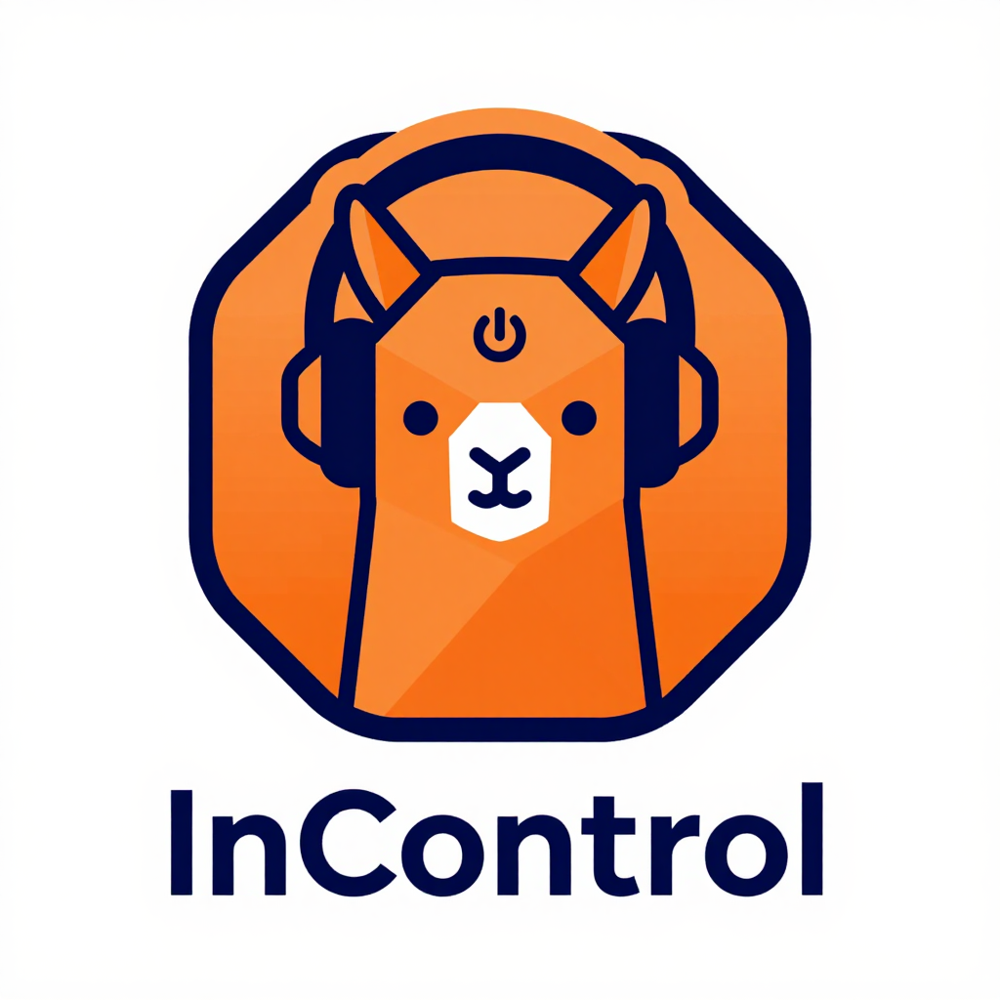

<p align="center">
  <a href="README.ja.md">日本語</a> | <a href="README.zh.md">中文</a> | <a href="README.es.md">Español</a> | <a href="README.fr.md">Français</a> | <a href="README.md">English</a> | <a href="README.it.md">Italiano</a> | <a href="README.pt-BR.md">Português (BR)</a>
</p>

<p align="center"></p>

<h1 align="center">InControl</h1>

<p align="center">
  
  
  <a href="https://github.com/mcp-tool-shop-org/incontrol/actions/workflows/ci.yml"></a>
  <a href="https://codecov.io/gh/mcp-tool-shop-org/incontrol"></a>
  <a href="https://mcp-tool-shop-org.github.io/incontrol/"></a>
  <a href="LICENSE"></a>
</p>

**विंडोज के लिए ओलामा चैट।** इस पीसी पर डिफ़ॉल्ट रूप से। एक जीपीयू जिसे आपने एसएसएच के माध्यम से किराए पर लिया है, जब आप ऐसा करने के लिए कहेंगे।

इनकंट्रोल ओलामा एचटीटीपी एपीआई का उपयोग करता है। जब तक आप किसी को कनेक्ट नहीं करते, तब तक कुछ भी किराए पर नहीं भेजा जाता है। शीर्ष पर मौजूद बार तब उस मशीन का नाम देता है और कहता है कि चैट इस पीसी को छोड़ देगा।

## इनकंट्रोल क्यों?

- **सबसे पहले यह पीसी।** प्रॉम्प्ट तब तक यहीं रहेंगे जब तक आप किराए पर लिए गए जीपीयू को कनेक्ट नहीं करते।
- **किसी भी तरह से समान ओलामा।** एक किराए पर ली गई मशीन `127.0.0.1:11434` पर ओलामा चलाती है। इनकंट्रोल एसएसएच लोकल फॉरवर्ड के साथ इससे जुड़ता है। एचटीटीपी क्लाइंट कभी भी सार्वजनिक पोर्ट से बात नहीं करता है।
- **यह उपकरण अनुमति सूची नहीं है।** कनेक्टिविटी सहायक उपकरण यूआरएल को नियंत्रित करती है। यह यह तय नहीं करता है कि चैट कहाँ चलती है।
- **विनयूआई 3।** एक विंडोज ऐप, जिसमें थ्रेड में मार्कडाउन है।
- **सहायक प्रोफाइल** - कॉन्फ़िगर करने योग्य व्यक्तित्व, विस्तार और जोखिम सहनशीलता
- **प्लगइन सिस्टम** - सैंडबॉक्स्ड प्लगइन्स और एक मेनिफेस्ट-आधारित एसडीके के साथ कार्यक्षमता का विस्तार करें
- **नीति इंजन** - ऑर्ग/टीम/उपयोगकर्ता नीति परतें उपकरणों, प्लगइन्स, मेमोरी और कनेक्टिविटी को नियंत्रित करती हैं
- **कनेक्टिविटी मोड** - केवल ऑफ़लाइन, सहायता प्राप्त, या पूर्ण ऑडिट लॉगिंग के साथ कनेक्टेड

## नुगेट पैकेज

मुख्य लाइब्रेरी आपके स्वयं के स्थानीय एआई एकीकरण बनाने के लिए स्टैंडअलोन नुगेट पैकेजों के रूप में उपलब्ध हैं:

| पैकेज | संस्करण | विवरण |
|---------|---------|-------------|
| [InControl.Core](https://www.nuget.org/packages/InControl.Core) | [](https://www.nuget.org/packages/InControl.Core) | स्थानीय एआई चैट अनुप्रयोगों के लिए डोमेन मॉडल, वार्तालाप प्रकार और साझा अमूर्तता। |
| [InControl.Inference](https://www.nuget.org/packages/InControl.Inference) | [](https://www.nuget.org/packages/InControl.Inference) | स्ट्रीमिंग चैट, मॉडल प्रबंधन और स्वास्थ्य जांच के साथ एलएलएम बैकएंड अमूर्त परत। इसमें ओलामा कार्यान्वयन शामिल है। |

```bash
dotnet add package InControl.Core
dotnet add package InControl.Inference
```

```csharp
// Example: use InControl.Inference in your own app
var client = inferenceClientFactory.Create("ollama");
await foreach (var token in client.StreamChatAsync(messages))
{
    Console.Write(token);
}
```

## लक्ष्य हार्डवेयर

| घटक | न्यूनतम | अनुशंसित |
|-----------|---------|-------------|
| जीपीयू | आरटीएक्स 3060 (8 जीबी) | आरटीएक्स 4080/5080 (16 जीबी) |
| रैम | 16 जीबी | 32 जीबी |
| OS | विंडोज 10 1809+ | विंडोज 11 |
| .नेट | 9.0 | 9.0 |

## स्थापना

स्रोत से बनाएं। अभी तक इस रिपॉजिटरी का कोई एमएसआईएक्स रिलीज़ नहीं है।

```bash
git clone https://github.com/mcp-tool-shop-org/incontrol.git
cd incontrol
dotnet restore
dotnet build

# Run (Ollama on this PC)
dotnet run --project src/InControl.App
```

## पूर्व आवश्यकताएँ

इनकंट्रोल को एक स्थानीय एलएलएम बैकएंड की आवश्यकता होती है। हम [ओलामा](https://ollama.ai/) की अनुशंसा करते हैं:

```bash
# Install Ollama from https://ollama.ai/download

# Pull a model
ollama pull llama3.2

# Start the server (runs on http://127.0.0.1:11434)
ollama serve
```

## एक किराए पर लिया गया जीपीयू

सेटिंग्स → **यह चैट कहाँ चलती है।** किराए पर ली गई मशीन से सीधे एसएसएच कमांड पेस्ट करें (`ssh -p <mapped-port> root@<public-ip> -i <key>`)। बटन कहता है कि चैट उस मशीन पर भेजी जाएगी।

फॉरवर्ड इस पीसी पर `127.0.0.1:11436` पर सुनता है, न कि `11434` पर। चैट तब तक यहीं रहती है जब तक कि ओलामा उस पोर्ट के माध्यम से उत्तर नहीं देता।

किराए पर ली गई मशीन पर ओलामा को `127.0.0.1:11434` पर छोड़ दें। `OLLAMA_HOST=0.0.0.0` सेट न करें, और पोर्ट 11434 को प्रकाशित न करें। एसएसएच पोर्ट मैप किया गया एसएसएचडी पोर्ट है, न कि 11434।

रनपॉड का `ssh.runpod.io` प्रॉक्सी केवल एक शेल है। यह पोर्ट को फॉरवर्ड नहीं कर सकता है। **मेरे रनपॉड पॉड्स को देखें** पर्यावरण से `RUNPOD_API_KEY` का उपयोग करता है और पॉड के सीधे सार्वजनिक-आईपी एसएसएच को भरता है। कुंजी संग्रहीत नहीं है। लुकअप पॉड शुरू नहीं करता है और चैट नहीं भेजता है। विशाल प्रत्यक्ष पते पर फॉरवर्ड का दस्तावेजीकरण करता है। पता तब मर जाता है जब किराए पर ली गई मशीन पुनरारंभ होती है। पॉड को फिर से देखें, या नया कमांड पेस्ट करें। निजी कुंजी इस पीसी पर रहती है।

पूर्ण नियम [docs/COMPUTE.md](docs/COMPUTE.md) में हैं।

## बिल्डिंग

### बिल्ड वातावरण सत्यापित करें

```powershell
# Run verification script
./scripts/verify.ps1
```

### विकास बिल्ड

```bash
dotnet build
```

### रिलीज़ बिल्ड

```powershell
# Creates release artifacts in artifacts/
./scripts/release.ps1
```

### परीक्षण चलाएँ

```bash
dotnet test
```

## आर्किटेक्चर

इनकंट्रोल एक स्वच्छ, लेयर्ड आर्किटेक्चर का पालन करता है:

```
+-------------------------------------------+
|         InControl.App (WinUI 3)           |  UI Layer
+-------------------------------------------+
|         InControl.ViewModels              |  Presentation
+-------------------------------------------+
|         InControl.Services                |  Business Logic
+-------------------------------------------+
|         InControl.Inference               |  LLM Backends
+-------------------------------------------+
|         InControl.Core                    |  Shared Types
+-------------------------------------------+
```

विस्तृत डिज़ाइन दस्तावेज़ के लिए [ARCHITECTURE.md](./docs/ARCHITECTURE.md) देखें।

### प्रमुख उप-प्रणालियाँ

| उप-प्रणाली | नेमस्पेस | उद्देश्य |
|-----------|-----------|---------|
| सहायक | `InControl.Core.Assistant` | प्रोफाइल, मेमोरी स्टोर, व्यक्तित्व गार्ड, ऑनबोर्डिंग |
| प्लगइन | `InControl.Core.Plugins` | एसडीके के साथ मेनिफेस्ट-मान्य, सैंडबॉक्स्ड विस्तारशीलता |
| नीति | `InControl.Core.Policy` | जेएसओएन नीति दस्तावेज़ (ऑर्ग/टीम/उपयोगकर्ता), उपकरण/प्लगइन/मेमोरी/कनेक्टिविटी नियम |
| कनेक्टिविटी | `InControl.Core.Connectivity` | ऑडिट ट्रेल के साथ तीन-मोड नेटवर्क शासन |
| स्वास्थ्य | `InControl.Services.Health` | प्लग करने योग्य स्वास्थ्य जांच (ऐप, अनुमान, भंडारण) |
| निदान | `InControl.Core.Diagnostics` | स्वच्छ कॉन्फ़िगरेशन के साथ समर्थन बंडल निर्माण |

## डेटा संग्रहण

सभी डेटा स्थानीय रूप से संग्रहीत हैं:

| डेटा | स्थान |
|------|----------|
| सत्र | `%LOCALAPPDATA%\InControl\sessions\` |
| लॉग | `%LOCALAPPDATA%\InControl\logs\` |
| कैश | `%LOCALAPPDATA%\InControl\cache\` |
| निर्यात | `%USERPROFILE%\Documents\InControl\exports\` |

पूर्ण डेटा हैंडलिंग दस्तावेज़ के लिए [PRIVACY.md](./docs/PRIVACY.md) देखें।

## समस्या निवारण

सामान्य समस्याओं और समाधानों को [TROUBLESHOOTING.md](./docs/TROUBLESHOOTING.md) में प्रलेखित किया गया है।

### त्वरित समाधान

**ऐप शुरू नहीं हो रहा है:**
- जांचें कि .NET 9.0 रनटाइम स्थापित है
- सत्यापित करने के लिए `dotnet --list-runtimes` चलाएँ

**कोई मॉडल उपलब्ध नहीं है:**
- सुनिश्चित करें कि ओलामा चल रहा है: `ollama serve`
- एक मॉडल खींचें: `ollama pull llama3.2`

**जीपीयू का पता नहीं चला:**
- नवीनतम संस्करण में एनवीडिया ड्राइवर अपडेट करें
- CUDA टूलकिट स्थापना की जांच करें

## योगदान

योगदान का स्वागत है! कृपया:

1. रिपॉजिटरी को फोर्क करें
2. एक सुविधा शाखा बनाएँ
3. नई कार्यक्षमता के लिए परीक्षण लिखें
4. एक पुल अनुरोध सबमिट करें

## मुद्दे की रिपोर्ट करना

1. सबसे पहले [TROUBLESHOOTING.md](./docs/TROUBLESHOOTING.md) देखें
2. ऐप में "कॉपी डायग्नोस्टिक्स" सुविधा का उपयोग करें
3. संलग्न डायग्नोस्टिक्स जानकारी के साथ एक मुद्दा खोलें

## तकनीकी स्टैक

| परत | प्रौद्योगिकी |
|-------|------------|
| यूआई फ्रेमवर्क | विनयूआई 3 (विंडोज ऐप एसडीके 1.6) |
| आर्किटेक्चर | कम्युनिटीटूलकिट.एमवीएम के साथ एमवीवीएम |
| एलएलएम एकीकरण | ओलामाशार्प, माइक्रोसॉफ्ट.एक्सटेंशन.एआई |
| डीआई कंटेनर | माइक्रोसॉफ्ट.एक्सटेंशन्स.डिपेंडेंसीइंजेक्शन |
| कॉन्फ़िगरेशन | माइक्रोसॉफ्ट.एक्सटेंशन्स.कॉन्फ़िगरेशन |
| लॉगिंग | माइक्रोसॉफ्ट.एक्सटेंशन्स.लॉगिंग + सेरिलॉग |

## संस्करण

वर्तमान संस्करण: **0.3.0**

रिलीज़ इतिहास के लिए [चेंजलॉग.एमडी](./चेंजलॉग.एमडी) देखें।

## सुरक्षा और डेटा दायरा

इनकंट्रोल, ओलामा के लिए एक विनयूआई 3 चैट एप्लिकेशन है।

- **पहुंची गई डेटा:** इस पीसी पर ओलामा, स्थानीय स्टोरेज में चैट इतिहास, और, केवल एक कनेक्ट करने के बाद, एसएसएच के माध्यम से आप जिस मशीन तक पहुँचते हैं, उस पर ओलामा।
- **पहुंची नहीं गई डेटा:** कोई इनकंट्रोल खाता नहीं, कोई टेलीमेट्री नहीं, कोई एनालिटिक्स नहीं।
- **अनुमतियाँ:** ओलामा के लिए लूपबैक एचटीटीपी, जब आप किसी किराये की मशीन को कनेक्ट करते हैं तो इस पीसी पर एक एसएसएच क्लाइंट, और चैट इतिहास के लिए फ़ाइल सिस्टम।

पूर्ण नीति: [सिक्योरिटी.एमडी](सिक्योरिटी.एमडी)

---

## सहायता

- **बग रिपोर्ट:** [इश्यूज़](https://github.com/mcp-tool-shop-org/incontrol/issues)
- **सुरक्षा:** [सिक्योरिटी.एमडी](सिक्योरिटी.एमडी)

## लाइसेंस

[एमआईटी](लाइसेंस) -- पूर्ण पाठ के लिए [लाइसेंस](लाइसेंस) देखें।

---

<p align="center">
  Built by <a href="https://mcp-tool-shop.github.io/">MCP Tool Shop</a>
</p>
